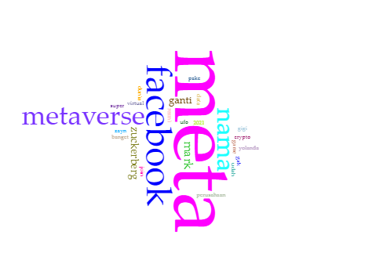
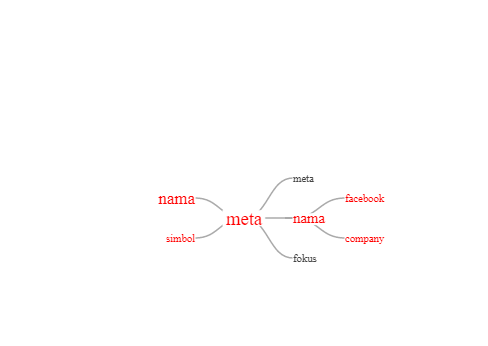

# Tugas1_KapSel 
## Team Member
1. Aisyah Nur Salsabila (11180940000036)
2. Malina Putri Afemi   (11180940000045)
3. Dewi Rizki Fitriani  (11180940000046)
## Project Overview
### Exploratory Data Analysis (EDA)

#### 1. Tweet yang Paling Banyak Diretweet
Dari data, diperoleh bahwa tweet yang paling banyak diretweet yaitu

>RT @weareoneEXO: BAEKHYUN JAPAN 1st MINI ALBUM 「BAEKHYUN」
>'Get You Alone'

>🎧 Melon: https://t.co/urd9upmCv3**
>🎧 FLO: https://t.co/YJC5wNUvYl…

Tweet ini diretweet sebanyak 21636 kali. Namun, tweet ini tidak berhubungan dengan topik Meta, oleh karena itu kami tertarik untuk melihat tweet selanjutnya yang juga banyak diretweet. Namun, setelah melihat hingga 30 tweet dengan retweet terbanyak, ternyata tweet-tweet tersebut juga tidak berhubungan dengan topik Meta.

#### 2. Tweet yang Paling Banyak Dilike
Dari data, diperoleh bahwa tweet yang paling banyak di like yaitu

>“Facebook dah tukar nama syarikat jadi Meta. Dia tengah build in satu platform nama Metaverse. 

>Welcome to cyberpunk 2077. Kita semua boleh hidup &amp; tinggal dalam virtual world. Mark dah lama rancang, kita yang terlupa nak lalai 😔☝️”

Tweet ini memperoleh sebanyak 2571 like. Namun, tweet ini merupakan tweet berbahasa Malaysia. Oleh karena itu, kami tertarik untuk melihat tweet dengan like terbanyak kedua. Dan ternyata pada data, tweet dengan like terbanyak kedua dan ketiga juga merupakan tweet berbahasa Malaysia. Baru setelah itu tweet dengan like terbanyak keempat merupakan tweet berbahasa Indonesia yaitu

“Kenapa Facebook ganti nama jadi Meta ?

Karena kalo namanya Neno entar demo mulu..”

Tweet ini memperoleh sebanyak 1831 like.

#### 3. Peak Time Ditulisnya Tweet yang Berkaitan dengan Meta

Berdasarkan bar plot di atas, dapat diketahui bahwa peak time ditulisnya tweet yang berkaitan dengan Meta adalah pada pukul 4 - 5 pagi. Dari 15379 tweet yang ada, sebanyak 908 tweet ditweet pada pukul 4 - 5 pagi. Selanjutnya dari bar plot di atas, juga dapat diketahui bahwa waktu terbanyak kedua munculnya tweet yang berkaitan dengan Meta adalah pada pukul 3 - 4 pagi, yaitu dari 15379 tweet (jumlah tweet ini merupakan jumlah setelah duplikasi pada data dihilangkan), sebanyak 825 tweet ditweet pada pukul 3 - 4 pagi. Dan dari bar plot di atas juga dapat dilihat bahwa dari 10 waktu terbanyak ditulisnya tweet, sebanyak 7 waktu merupakan pagi dan dini hari. Ini artinya berdasarkan data, tweet-tweet yang membahas tentang Meta banyak ditweet pada pagi dan dini hari. CEO Facebook, yaitu Mark Zuckerberg, mengumumkan perubahan nama perusahaan Facebook menjadi Meta pada pukul 10.00 PT atau pukul 00.00 WIB pada 28 Oktober 2021 (https://www.facebookconnect.com/en-gb/).

### Visualisasi dengan Voyant

#### 1. Bubbles

Berdasarkan visualisasi di atas, setelah melalui tahap preprocessing, dapat diketahui bahwa kata yang paling sering muncul pada data adalah kata ‘meta’. Hal ini dapat dilihat dari ukuran gelembung atau bubble dari kata ‘meta’ lebih besar dibandingkan dengan kata-kata lain yang ada pada data tweet. Dari 37717 kata yang terdapat pada data tweet, kata ‘meta’ muncul sebanyak 13129 kali. Selain kata ‘meta’, kata ‘facebook’ (3291 kali), ‘metaverse’ (2221 kali), ‘nama’ (1881 kali), ‘mark’ (844 kali)  juga merupakan kata yang sering muncul pada data.

#### 2. WordCloud

Berdasarkan hasil visualisasi menggunakan [Voyant](https://voyant-tools.org/), yang dilakukan setelah melalui tahap prepocessing, dapat kita ketahui bahwa katab yang sering muncul pada data adalah kata **meta** hal ini dapat dilihat dari semakin besar ukuran kata maka semakin sering kata tersebut muncul. Kemudian, di hari yang sama terdapat topik yang sedang trending seperti _zayn_ dan _gigi_ yang biasanya saat suatu topik sendang _trending_ maka sering disangkut pautkan dengan hal-hal yang lainnya.

#### 3. WordTree

Berdasarkan visualisasi yang dilakukan pada [Voyant](https://voyant-tools.org/) dengan _visualization-tools_ menggunakan **WordTree** kata  **meta**, **simbol** dan **nama** berhubungan dengan **facebook** dan **company**. Dalam hal ini telah bersesuaian dengan trending topicnya bahwa perusahaan facebook melakukan perubahan nama menjadi meta.

#### 4. Links
! [alt text]_ (Image/link.png)

Pada visualisasi Voyant Links yang terdiri atas tiga keyword yang saling terhubung, yaitu “meta” (3953), “facebook” (3291), dan “metaverse” (2221). Keyword dengan frekuensi terbanyak, yaitu “meta”, terhubung dengan tiga collocate, yaitu “nama” (1940), “ganti” (971), dan “mark” (904). Hal ini menyatakan bahwa ketika pada satu tweet atau data terdapat keyword “meta”, keyword tersebut diperjelas dengan kata “nama” , “ganti”, dan “mark”. Keyword “facebook” terhubung dengan “nama”, “ganti”, dan “zuckerberg” (574), ini menunjukkan bahwa “nama”, “ganti”,  dan “zuckerberg” memperjelas konteks atau topik yang berhubungan dengan “facebook”. Keyword “metaverse” terhubung dengan “virtual” (307) dan “galactic” (280), yang menyatakan bahwa “virtual” dan “galactic” menjelaskan keyword “metaverse”.

Berdasarkan hasil analisis tweet yang diperoleh, dapat disimpulkan bahwa para pengguna twitter membicarakan tentang istilah meta, aplikasi facebook, dan teknologi metaverse. Dengan adanya hubungan atau jaringan dari kata-kata tersebut, kita dapat memperoleh kesimpulan secara kasar mengenai data tweet.

Ketika pengguna twitter menulis tweet tentang istilah meta, mereka cenderung menyebutkan hal yang berhubungan dengan nama, menyinggung suatu pergantian, serta seseorang bernama Mark. Pengguna twitter juga membahas suatu hal mengenai suatu nama, pergantian sesuatu, dan teknologi metaverse saat membahas aplikasi facebook. Untuk istilah teknologi metaverse, pengguna twitter cenderung menyebutkan kata galactic dan konsep virtual.
